# Summer Analytics 2025 - Assignment Submission


## 📌 Assignment Details  WEEK 1
- **Course**: Summer Analytics 2025  
- **Assignment**: Data Analysis Practice Assignment  
- **Dataset**: [`Cars.csv`](Week_1/Cars.csv)  
- **Tools**: Python, Pandas, NumPy, Jupyter Notebook  

---

## 🚀 Description  
This repository contains my solution for the **Week 1 Assignment** of *Summer Analytics 2025*. The assignment focuses on foundational data analysis skills, including data manipulation, cleaning, and exploration using Python libraries like Pandas and NumPy. The solution is implemented in a Jupyter Notebook (`SA2025_W1.ipynb`) and uses the provided `Cars.csv` dataset.

---

## 📂 Repository Structure
```text
Week_1/
├── Cars.csv                     # Dataset for the assignment
├── SA2025_W1.ipynb              # Jupyter Notebook with analysis and solutions
└── Summer Analytics 2025-2.pdf  # Assignment instructions (PDF)
```

## 📌 Assignment Details - WEEK 2
#  NDVI Classification for Agricultural Analysis

This project leverages NDVI (Normalized Difference Vegetation Index) time-series data to classify crop health or land types using statistical and machine learning techniques. It uses logistic regression with feature engineering and calibrated classification.

## 📁 Files

- `ndvi_classification_fixed.ipynb`: Jupyter Notebook containing the complete data pipeline, from preprocessing to model prediction and export.
- `hacktrain.csv`: Training dataset.
- `hacktest.csv`: Test dataset.

## 📊 Dataset Description

The datasets contain NDVI readings over time (e.g., columns like `NDVI_1_N`, `NDVI_2_N`, ...), which are used to classify each sample into a respective class label.

- **Train file:** Includes NDVI features + `class` label.
- **Test file:** Includes NDVI features only.
- **Target:** Predict the `class` column for test data.

## 🔍 Feature Engineering

Custom statistical features are extracted:
- Mean, median, standard deviation, skewness, kurtosis of NDVI values
- Quartile-wise means
- Last-3 NDVI mean (recent trend)
- Missing value counts and ratios
- Derived metrics: NDVI stability and seasonality

## ⚙️ Model Pipeline

The pipeline includes:
1. **RobustScaler**: Scales features while being robust to outliers.
2. **SelectFromModel**: Feature selection using L1-penalized logistic regression.
3. **CalibratedClassifierCV**: Logistic regression with probability calibration.

### Model Details:
- Base estimator: Logistic Regression (L2)
- Calibration: 5-fold cross-validation
- Evaluation: 10-fold stratified cross-validation (Accuracy)

## 📈 Results

The model achieves stable performance across folds with high accuracy and reliability due to calibration.

## 🚀 How to Run

1. Ensure you have Python 3.8+ and install required libraries:
    ```bash
    pip install pandas numpy scikit-learn
    ```
2. Place `hacktrain.csv` and `hacktest.csv` in the same directory.
3. Run the notebook `ndvi_classification_fixed.ipynb`.
4. The predictions will be saved as `submission.csv`.

---

# WEEK 5- Dynamic Pricing for Urban Parking Lots

> **Capstone Project** of Summer Analytics 2025  
> Hosted by Consulting & Analytics Club × Pathway

---

## 🚀 Overview

Urban parking spaces are scarce and highly demanded. Static pricing often leads to overcrowding or under‐utilization. In this project, we build a **real-time dynamic pricing engine** for 14 parking lots using historical data, environmental features, and competitor intelligence. Starting from a base price of $10, our models adjust prices smoothly based on occupancy, queue length, traffic conditions, special events, vehicle types, and nearby competitor rates.

> **Key goals**  
> - Real-time price updates with Pathway streaming  
> - Three pricing models (baseline, demand-based, competitive)  
> - Explainable, bounded, smooth price variations  
> - Optional rerouting suggestions when lots are full

Please see the full problem statement in [problem_statement.pdf](./problem_statement.pdf).

---

## 🛠️ Tech Stack

- **Language & Libraries**  
  - Python 3.x  
  - pandas, numpy (data processing)  
  - Pathway (real‑time simulation & streaming)  
  - Bokeh (real‑time visualizations)

- **Environment**  
  - Google Colab (notebook execution)  
  - Git & GitHub (version control)

---

## 🏗️ Architecture Diagram

```mermaid
flowchart LR
  A["Raw Parking Data\n(CSV; 14 lots × 73 days)"] --> B["Pathway Simulation\n(ingest & stream)"]
  B --> C["Feature Engineering\n(occupancy rate, queue, traffic, events)"]
  C --> D["Pricing Engine"]
  D --> D1["Model 1:\nBaseline Linear"]
  D --> D2["Model 2:\nDemand‑Based"]
  D --> D3["Model 3:\nCompetitive"]
  D1 & D2 & D3 --> E["Price Output\n($ per lot)"]
  F["Competitor Data\n(geo + prices)"] --> D3
  E --> G["Bokeh Visualizations"]
  G --> H["Dashboard & Insights"]

```



---

## 📝 Project Architecture & Workflow

1. **Data Ingestion (Pathway)**  
   - **Source:** `dataset.csv` with timestamped records for 14 lots  
   - **Tool:** Pathway’s streaming API to replay data in real time  

2. **Feature Engineering**  
   - **Occupancy Rate:** `occupancy / capacity`  
   - **Queue Length:** instantaneous queue count  
   - **Traffic Level:** external congestion metric  
   - **Special Day Flag:** holidays, events  
   - **Vehicle Type Weights:** car, bike, truck multipliers  

3. **Pricing Engine**  
   - **Model 1: Baseline Linear**  
     \[
       P_{t+1} = P_t + \alpha \times \frac{\text{occupancy}}{\text{capacity}}
     \]
   - **Model 2: Demand‑Based**  
     \[
       \text{demand} = \alpha\frac{occ}{cap}
       + \beta\,\text{queue}
       - \gamma\,\text{traffic}
       + \delta\,\text{special}
       + \varepsilon\,\text{vehicleWeight}
     \]  
     \[
       P_t = P_{\text{base}} \bigl(1 + \lambda \times \text{NormalizedDemand}\bigr)
     \]
   - **Model 3: Competitive Pricing**  
     - Compute geo‑distance to nearby lots  
     - Incorporate competitor prices  
     - Suggest reroute if yours is full and others are cheaper  

4. **Output & Visualization**  
   - Emit new prices every 30 minutes  
   - Real‑time line plots in Bokeh comparing your lot vs. competitors  
   - Dashboard highlights peak demand and rerouting suggestions  

5. **Deployment & Collaboration**  
   - All code in a single Colab notebook (`parking_pricing_system_final.ipynb`)  
   - Versioned via GitHub for transparency and review  

---

## 📂 Repository Contents

```
├── README.md
├── problem_statement.pdf          # Project specification
├── parking_pricing_system_final.ipynb
├── data/
│   └── dataset.csv
├── requirements.txt               # pandas, numpy, pathway, bokeh
└── images/                        # (optional) architecture diagrams/screenshots
```

---

## ▶️ How to Run

1. **Clone the repo**  
   ```bash
   git clone https://github.com/<your‑username>/dynamic-parking-pricing.git
   cd dynamic-parking-pricing
   ```

2. **Open in Google Colab**  
   - Upload `dataset.csv` under `/data`  
   - Open `parking_pricing_system_final.ipynb`  

3. **Install dependencies**  
   ```bash
   pip install -r requirements.txt
   ```

4. **Execute all cells**  
   - Make sure Pathway credentials (if any) are configured  
   - Visualizations will appear inline  

---

## 📤 Submission
Submitted via GitHub repository link as per course guidelines.


## ✅ Honor Code
I certify that this assignment is my own work, completed in accordance with the Summer Analytics 2025 Honor Code. 

## 📧 Contact
For questions or feedback:
LinkedIN - www.linkedin.com/in/kevin-joe-arikkatt | GitHub Profile - https://github.com/G-KevinJoe

---

