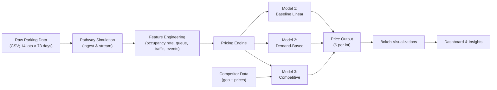

# Dynamic Pricing for Urban Parking Lots

> **Capstone Project** of Summer Analytics 2025  
> Hosted by Consulting & Analytics Club × Pathway

---

## 🚀 Overview

Urban parking spaces are scarce and highly demanded. Static pricing often leads to overcrowding or under‐utilization. In this project, we build a **real-time dynamic pricing engine** for 14 parking lots using historical data, environmental features, and competitor intelligence. Starting from a base price of $10, our models adjust prices smoothly based on occupancy, queue length, traffic conditions, special events, vehicle types, and nearby competitor rates.

> **Key goals**  
> - Real-time price updates with Pathway streaming  
> - Three pricing models (baseline, demand-based, competitive)  
> - Explainable, bounded, smooth price variations  
> - Optional rerouting suggestions when lots are full

Please see the full problem statement in [problem_statement.pdf](./problem_statement.pdf).

---

## 🛠️ Tech Stack

- **Language & Libraries**  
  - Python 3.x  
  - pandas, numpy (data processing)  
  - Pathway (real‑time simulation & streaming)  
  - Bokeh (real‑time visualizations)

- **Environment**  
  - Google Colab (notebook execution)  
  - Git & GitHub (version control)

---

## 🏗️ Architecture Diagram



---

## 📝 Project Architecture & Workflow

1. **Data Ingestion (Pathway)**  
   - **Source:** `dataset.csv` with timestamped records for 14 lots  
   - **Tool:** Pathway’s streaming API to replay data in real time  

2. **Feature Engineering**  
   - **Occupancy Rate:** `occupancy / capacity`  
   - **Queue Length:** instantaneous queue count  
   - **Traffic Level:** external congestion metric  
   - **Special Day Flag:** holidays, events  
   - **Vehicle Type Weights:** car, bike, truck multipliers  

3. **Pricing Engine**  
   - **Model 1: Baseline Linear**  
     \[
       P_{t+1} = P_t + \alpha \times \frac{\text{occupancy}}{\text{capacity}}
     \]
   - **Model 2: Demand‑Based**  
     \[
       \text{demand} = \alpha\frac{occ}{cap}
       + \beta\,\text{queue}
       - \gamma\,\text{traffic}
       + \delta\,\text{special}
       + \varepsilon\,\text{vehicleWeight}
     \]  
     \[
       P_t = P_{\text{base}} \bigl(1 + \lambda \times \text{NormalizedDemand}\bigr)
     \]
   - **Model 3: Competitive Pricing**  
     - Compute geo‑distance to nearby lots  
     - Incorporate competitor prices  
     - Suggest reroute if yours is full and others are cheaper  

4. **Output & Visualization**  
   - Emit new prices every 30 minutes  
   - Real‑time line plots in Bokeh comparing your lot vs. competitors  
   - Dashboard highlights peak demand and rerouting suggestions  

5. **Deployment & Collaboration**  
   - All code in a single Colab notebook (`parking_pricing_system_final.ipynb`)  
   - Versioned via GitHub for transparency and review  

---

## 📂 Repository Contents

```
├── README.md
├── problem_statement.pdf          # Project specification
├── parking_pricing_system_final.ipynb
├── data/
│   └── dataset.csv
├── requirements.txt               # pandas, numpy, pathway, bokeh
└── images/                        # (optional) architecture diagrams/screenshots
```

---

## ▶️ How to Run

1. **Clone the repo**  
   ```bash
   git clone https://github.com/<your‑username>/dynamic-parking-pricing.git
   cd dynamic-parking-pricing
   ```

2. **Open in Google Colab**  
   - Upload `dataset.csv` under `/data`  
   - Open `parking_pricing_system_final.ipynb`  

3. **Install dependencies**  
   ```bash
   pip install -r requirements.txt
   ```

4. **Execute all cells**  
   - Make sure Pathway credentials (if any) are configured  
   - Visualizations will appear inline  

---

> _Developed by_ **Kevin Joe Prakash** – Summer Analytics 2025 Capstone  
> _Questions or feedback?_ Please open an issue or contact via GitHub.
